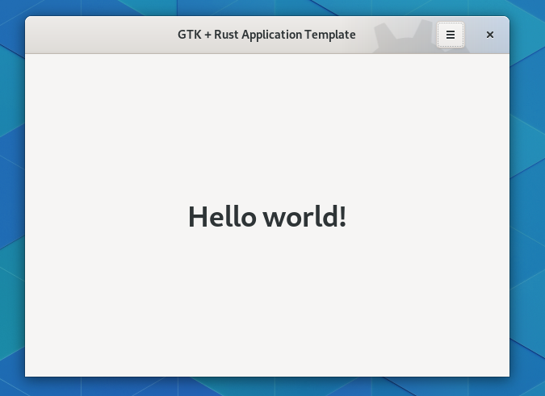

# GTK + Rust + Relm4 + Meson + Flatpak = <3

> This is a fork of [gtk-rust-template](https://gitlab.gnome.org/World/Rust/gtk-rust-template) that adapts the code for Relm4 while trying to change as little as possible.

A boilerplate template to get started with GTK, Rust, Meson, Flatpak made for GNOME. It can be adapted for other desktop environments like elementary.

<div align="center">


</div>

## What does it contains?

- A simple window with a headerbar
- Bunch of useful files that you SHOULD ship with your application on Linux:
  - Metainfo: describe your application for the different application stores out there;
  - Desktop: the application launcher;
  - Icons: This repo contains three icons, a normal, a nightly & monochromatic icon (symbolic) per the GNOME HIG, exported using [App Icon Preview](https://flathub.org/apps/details/org.gnome.design.AppIconPreview).
- Flatpak Manifest for nightly builds
- Dual installation support
- Uses Meson for building the application
- Bundles the UI files & the CSS using gresources
- A pre-commit hook to run rustfmt on your code
- Tests to validate your Metainfo, Schemas & Desktop files
- Gsettings to store the window state, more settings could be added
- Gitlab CI to produce flatpak nightlies
- i18n support

## How to init a project ?

The template ships a simple python script to init a project easily. It asks you a few questions and replaces & renames all the necessary files.

The script requires having `git` installed on your system.

If you clone this repository, you can run it with:

```shell
python3 create-project.py
```

If you don't want to clone the repository, you can run it with:

```shell
python3 -c "$(wget -q -O - https://raw.githubusercontent.com/Relm4/relm4-template/main/create-project.py)" --online
```

```shell
➜ python3 create-project.py
Welcome to GTK Rust Template
Name: Contrast
Project Name: contrast
Application ID (e.g. org.domain.MyAwesomeApp, see: https://developer.gnome.org/ChooseApplicationID/): org.gnome.design.Contrast
Author: Bilal Elmoussaoui
Email: bil.elmoussaoui@gmail.com
```

A new directory named `contrast` containing the generated project

## Building the project

Make sure you have `flatpak` and `flatpak-builder` installed. Then run the commands below. Replace `<application_id>` with the value you entered during project creation. Please note that these commands are just for demonstration purposes. Normally this would be handled by your IDE, such as GNOME Builder or VS Code with the Flatpak extension.

```shell
flatpak install --user org.gnome.Sdk//49 org.gnome.Platform//49  org.freedesktop.Sdk.Extension.rust-stable//25.08 org.freedesktop.Sdk.Extension.llvm21//25.08
flatpak-builder --user flatpak_app build-aux/<application_id>.Devel.json
```

### NixOS 
```bash
nix build . --show-trace
```

## Running the project

Once the project is build, run the command below. Replace `<application_id>` and `<project_name>` with the values you entered during project creation. Please note that these commands are just for demonstration purposes. Normally this would be handled by your IDE, such as GNOME Builder or VS Code with the Flatpak extension.

```shell
flatpak-builder --run flatpak_app build-aux/<application_id>.Devel.json <project_name>
```

### NixOS
```bash
nix run 
# or
cd .. && ./relm4-template/result/bin/gtk-rust-template
```

## Translations with Gettext

The template uses `gettext` as a framework for translations using [`gettext-rs`](https://github.com/gettext-rs/gettext-rs). The basic files for this can be found in the `po` folder.
While meson will take care of building the translations the extraction and translation itself has to be done manually.

### Extracting translatable strings

First of all you have to have `gettext` installed on your system. With that you then are able to use `xgettext` as following to extract the translatable strings:

```shell
xgettext --package-name=<project_name> --package-version=main --msgid-bugs-address=https://github.com/<project_name>/<project_name>/issues --files-from=po/POTFILES.in --output=po/<project_name>.pot
```

Note that you might need to update the `po/POTFILES.in` file to reflect the files of your process. This describes where `xgettext` is going to search for strings to translate.

### Translating the translatable strings

To translate the strings you need to use po files. Tools like Poedit allow you to generate these from the `po/<project_name>.pot` file.
It also allows you to sync the `po/<project_name>.pot` when you rerun `xgettext`.

When adding a po file also make sure to add the language code to `po/LINGUAS`.

## Community

Join the GNOME and gtk-rs community!

- [Matrix chat](https://matrix.to/#/#rust:gnome.org): chat with other developers using gtk-rs
- [Discourse forum](https://discourse.gnome.org/tag/rust): topics tagged with `rust` on the GNOME forum.
- [GNOME circle](https://circle.gnome.org/): take inspiration from applications and libraries already extending the GNOME ecosystem.

## Credits

- [Podcasts](https://gitlab.gnome.org/World/podcasts)
- [Shortwave](https://gitlab.gnome.org/World/Shortwave)
